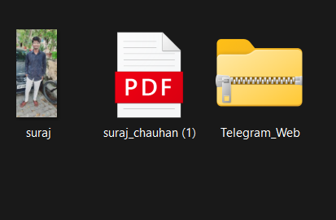

# Learn MArkdown


# heading 1
 paragraph

## heading 2

### heading 3

horizontal line 
--- 

**bold**

*ittlic*

> blockquote 

1. listItem1 orderlist
2. listItem2 
3. ....

- itme1 unoorderlist
- item2 
- ...

`one line coding`

python/py
```py
print(hello bhai it)
var = "multiple lineCode"

```
javascript/js

```js
console.log("it is multiple line js code")

```
c++/cpp

```cpp
int i = 2
int j = 4
cout<<"hello bhai";


```
links

[Google](https://google.com)

image




<!-- comment -->

imogi direct apply kr skte hai ya   
:joy:
:cool:

H~2~O


table
| first | second |
| --- | ---- |
  name1 | suraj
  name2 | anil

